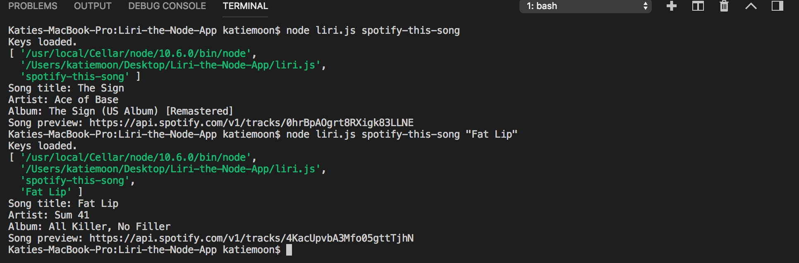
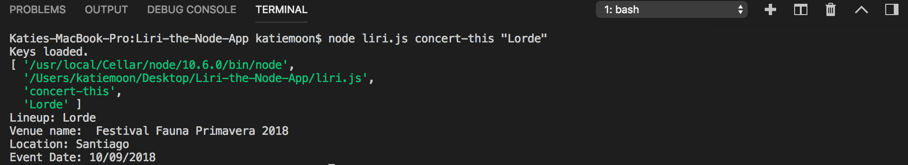
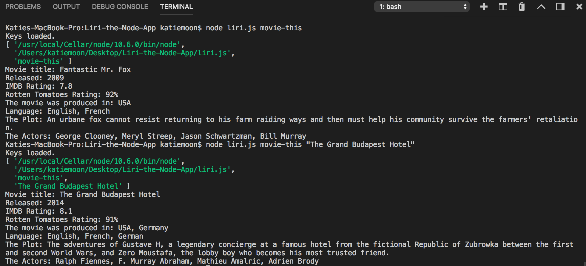

# Liri-the-Node-App

# What does the project do?
The application is run fully in node.js and takes commands and the user inputs and calls upon the Spotify API, the Bands in Town API, and the OMDB API. 

# Why is the project useful?
The project demonstrates a basic understanding of node.js and installing npm packages for performing tasks. 

# How can the user get started?
The user will need to get their own keys for Spotify but all of the other API calls will work with the current code. The user loads the files and then states a command and search interest.

The user can use the following commands:
1. spotify-this-song
2. concert-this
3. movie-this
4. do-what-it-says

After selecting which command the user wants to use, the user states their search interest after the command in the command line. An example of what this would look like is:

`spotify-this-song Fat Lip`

Here are some examples of the working code:
1. Running spotify-this-song with and without a parameter

2. Running concert-this

3. Running movie-this with and without a parameter

4. Running do-what-it-says

# Where can the users get help with the project?
Please contact me if you experience any problems!

# Who maintains and contributes to the project?
I am the sole contributor!
